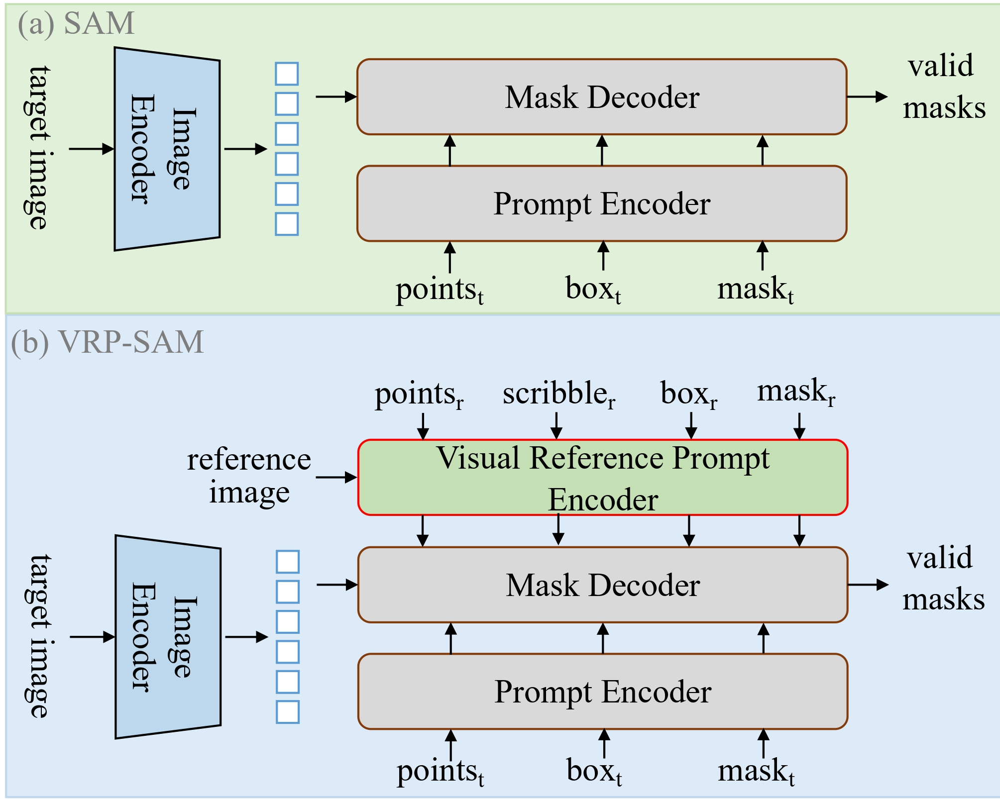
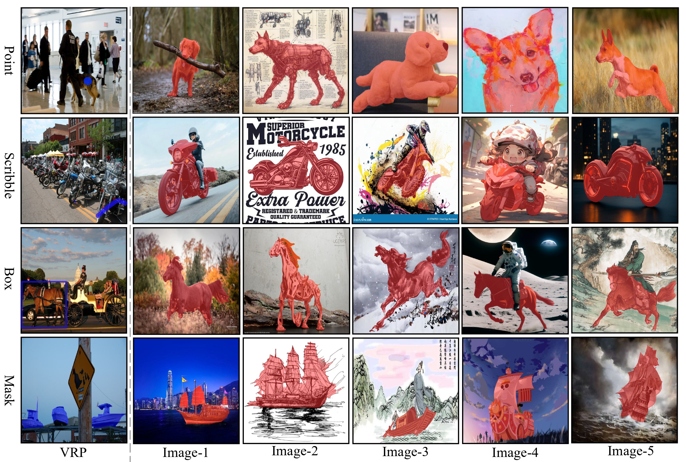

## VRP-SAM: SAM with Visual Reference Prompt

**Update**:
1. The manuscript has been accepted in __CVPR 2024__.
2. **Core code has been updated**

This is the official implementation based on pytorch of the paper [VRP-SAM: SAM with Visual Reference Prompt](https://arxiv.org/abs/2402.17726) 

Authors: Yanpeng Sun, Jiahui Chen, Shan Zhang, Xinyu Zhang, Qiang Chen, Gang Zhang, Errui Ding, Jingdong Wang, [Zechao Li](https://zechao-li.github.io/)

<p align="middle">
    
</p>

## Requirements

- Python 3.10
- PyTorch 1.12
- cuda 11.6

Conda environment settings:
```bash
conda create -n vrpsam python=3.10
conda activate vrpsam

conda install pytorch==1.12.1 torchvision==0.13.1 torchaudio==0.12.1 cudatoolkit=11.6 -c pytorch -c conda-forge
```

Segment-Anything-Model setting:
```bash
cd ./segment-anything
pip install -v -e .
cd ..
```

## Preparing Few-Shot Segmentation Datasets
Download following datasets:

> #### 1. PASCAL-5<sup>i</sup>
> Download PASCAL VOC2012 devkit (train/val data):
> ```bash
> wget http://host.robots.ox.ac.uk/pascal/VOC/voc2012/VOCtrainval_11-May-2012.tar
> ```
> Download PASCAL VOC2012 SDS extended mask annotations from our [[Google Drive](https://drive.google.com/file/d/10zxG2VExoEZUeyQl_uXga2OWHjGeZaf2/view?usp=sharing)].

> #### 2. COCO-20<sup>i</sup>
> Download COCO2014 train/val images and annotations: 
> ```bash
> wget http://images.cocodataset.org/zips/train2014.zip
> wget http://images.cocodataset.org/zips/val2014.zip
> wget http://images.cocodataset.org/annotations/annotations_trainval2014.zip
> ```
> Download COCO2014 train/val annotations from our Google Drive: [[train2014.zip](https://drive.google.com/file/d/1cwup51kcr4m7v9jO14ArpxKMA4O3-Uge/view?usp=sharing)], [[val2014.zip](https://drive.google.com/file/d/1PNw4U3T2MhzAEBWGGgceXvYU3cZ7mJL1/view?usp=sharing)].
> (and locate both train2014/ and val2014/ under annotations/ directory).


Create a directory '../dataset' for the above few-shot segmentation datasets and appropriately place each dataset to have following directory structure:

    ../                         # parent directory
    ├── ./                      # current (project) directory
    │   ├── common/             # (dir.) helper functions
    │   ├── data/               # (dir.) dataloaders and splits for each FSSS dataset
    │   ├── model/              # (dir.) implementation of VRP-SAM 
    │   ├── segment-anything/   # code for SAM
    │   ├── README.md           # intstruction for reproduction
    │   ├── train.py            # code for training HSNet
    │   └── SAM2Pred.py         # code for prediction module
    │    
    └── Datasets_HSN/
        ├── VOC2012/            # PASCAL VOC2012 devkit
        │   ├── Annotations/
        │   ├── ImageSets/
        │   ├── ...
        │   └── SegmentationClassAug/
        └── COCO2014/           
            ├── annotations/
            │   ├── train2014/  # (dir.) training masks (from Google Drive) 
            │   ├── val2014/    # (dir.) validation masks (from Google Drive)
            │   └── ..some json files..
            ├── train2014/
            └── val2014/
       

## Training
We provide a example training script "train.sh". Detailed training argumnets are as follows:

> ```bash
> python3 -m torch.distributed.launch --nproc_per_node=$GPUs$ train.py \
>         --datapath $PATH_TO_YOUR_DATA$ \
>         --logpath $PATH_TO_YOUR_LOG$ \
>         --benchmark {coco, pascal} \
>         --backbone {vgg16, resnet50, resnet101} \
>         --fold {0, 1, 2, 3} \
>         --condition {point, scribble, box, mask} \
>         --num_queirs 50 \
>         --epochs 50 \
>         --lr 1e-4 \
>         --bsz 2     
> ```


#### Example qualitative results (1-shot):

<p align="middle">
    
</p>
   
## BibTeX
If you use this code for your research, please consider citing:
````BibTeX
@inproceedings{sun2024vrp,
    title={VRP-SAM: SAM with Visual Reference Prompt},
    author={Sun, Yanpeng and Chen, Jiahui and Zhang, Shan and Zhang, Xinyu and Chen, Qiang and Zhang, Gang and Ding, Errui and Wang, Jingdong and Li, Zechao},
    booktitle={Conference on Computer Vision and Pattern Recognition 2024},
    year={2024}
}
````
